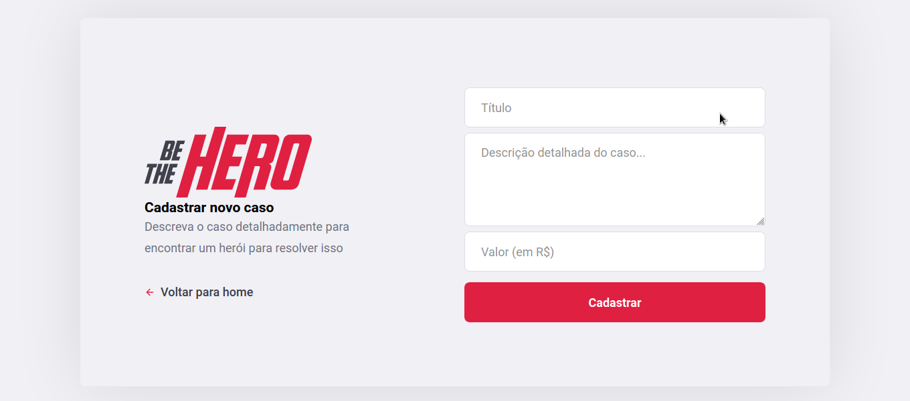

# Be The Hero

>Conecte pessoas que tem vontade de ajudar, mas que quase sempre não tem tempo, à ONGs diversas!
>Ajude ONGs a serem mais ativamente ajudadas pelas pessoas através da *Be The Hero*,
>onde pessoas podem ajudar de várias formas

## Navegação

### _Front-end_
>Aqui é onde se inicia a experiência! ONGs podem se cadastrar na plataforma e
>reportarem seus casos e deixarem seus contatos para possíveis interessados

#### Tela Inicial

#### Cadastro de uma ONG

#### Casos reportados pela ONG

#### Reportação de um caso pela ONG

### _Mobile_
>Aqui é onde pessoas podem se conectar com as ONGs!
>Todos os casos das ONGs são exibidos aqui e, junto com cada caso, as informações de contato de sua respectiva ONG, onde as pessoas interessadas podem obter mais informações

#### Tela de Splash

#### Casos reportados pelas ONGs

#### Detalhes de um caso

#### Envio de e-mail para a ONG responsável pelo caso

## Pre requisitos

Para rodar a aplicação você precisará do `Node.js`. 

Para instalá-lo siga os passos desta [página](https://nodejs.org/en/download/)

## Executando

### Api Rest
Para executar a Api Rest execute os seguintes passos:

> cd server

> npm install

> npm start

Então a api ficará disponível em `http://localhost:3333/`

### Client
Para executar a versão para web execute os seguintes passos:

> cd mobile

> npm install

> npm start

Então a aplicação ficará disponível em `http://localhost:3000/`

### Mobile

> npm install -g expo-cli

> cd mobile

> npm install

> expo start

Então o expo subirá um servidor em `http://localhost:19000` lá é possível escolher rodar a aplicação em um emulador ou em um celular físico.

PS: Para rodar em celular físico você precisará instalar o expo pelo loja de aplicativos.

## Construído com

* Node.js
* React 
* React Native
